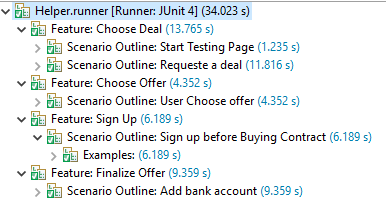
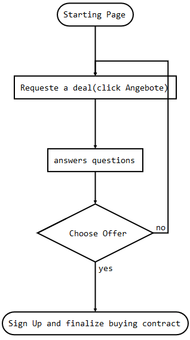

# Web Automation - CLARK

## Table of Contents

- [Technologies](#Technologies)
- [Senarcios](#Senarcios)
- [Test Structure & Runs ](#Test-Structure-and-execution)
- [Running configuration](#Running-configuration)

## Technologies
+ Java 8
+ Maven
+ Cucumber
+ Selenium
+ JUnit

## Senarcios
+ Choose Deal
    + Starting Page
    + Requeste a deal
+ Choose Offer
    + User choose offer
+ Sign Up
    + Sign Up before buying contract
+ Finalize Offer
    + Add bank account
    
    

## Test Structure and execution

> ** Screen recording of the automation run** : <https://share.getcloudapp.com/YEu1O4eA>
                    
### Methods and techniques 
The project is splitted into two main packages:
+ **MAIN** 
-Page Object [Driver life-cycle management]  // [Link](https://github.com/nidal94k/Hello_Clark/tree/master/Hello_Clark/src/main/java/PageObject)
-Pages [UI page elements]  // [Link](https://github.com/nidal94k/Hello_Clark/tree/master/Hello_Clark/src/main/java/Pages)
-Helper [Runner class & common helper class]  // [Link](https://github.com/nidal94k/Hello_Clark/tree/master/Hello_Clark/src/main/java/Helper)

+ **TEST** 
-Java            [Java Test classes]  // [Link](https://github.com/nidal94k/Hello_Clark/tree/master/Hello_Clark/src/test/java/Web_Automation)
-Rescources [Cucumber files]  // [Link](https://github.com/nidal94k/Hello_Clark/tree/master/Hello_Clark/src/test/resources/Web_Automation)

### Running configuration
- Import project from Github to Eclipse 
- Run src/main/java Helper/runner.java class
- In case of multiple runners, select Eclipse runner
